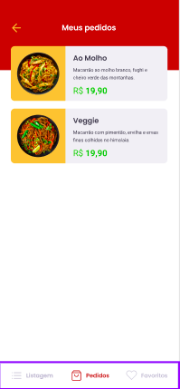

<h1 align="center" style="color:red;">
    
</h1>

<h2 align="center">
   
 GoRestaurant 

</h2>

  
  

 
<h3>Imagens da aplicação:<h3>

  
  
  
  
  
  
  

## :rocket: Tecnologias
- ReactJS
- Javascript
